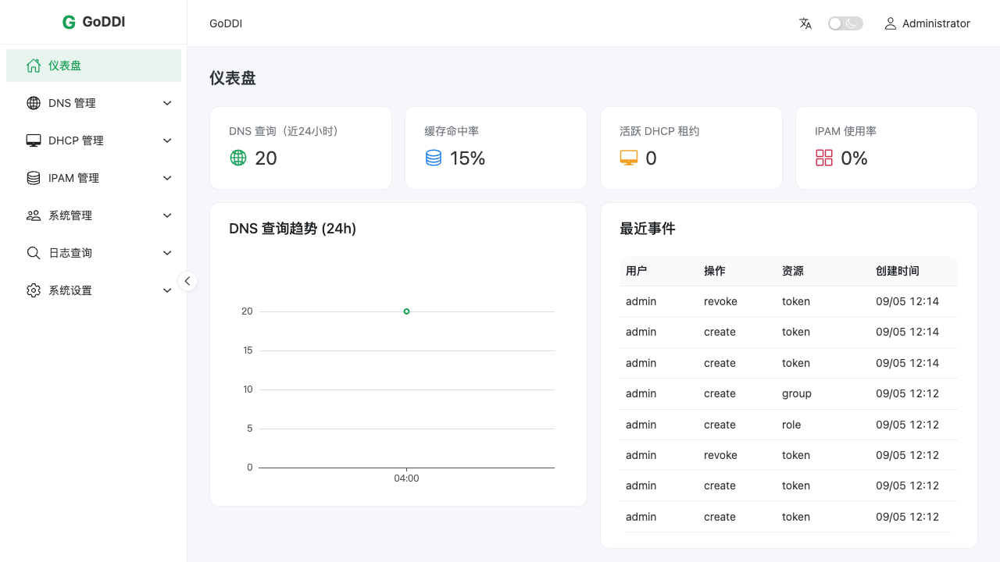
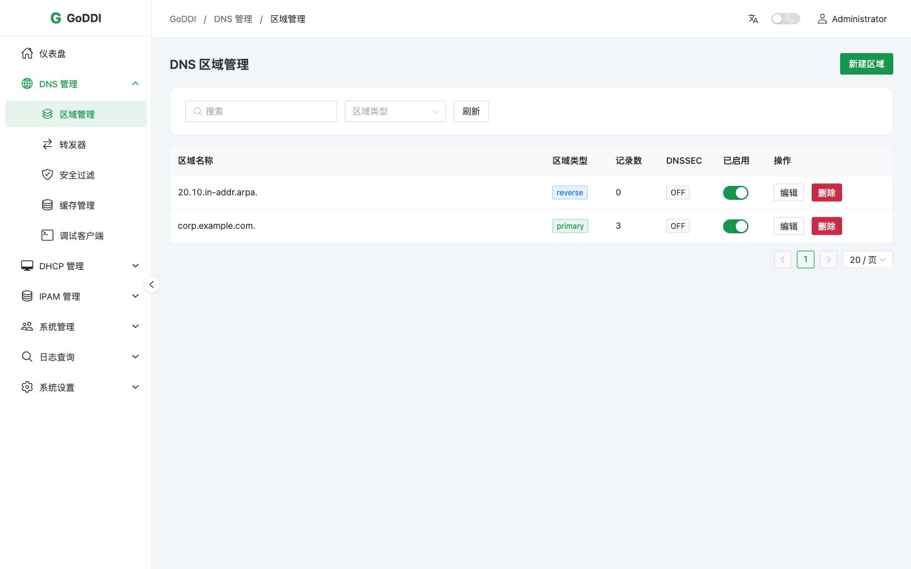
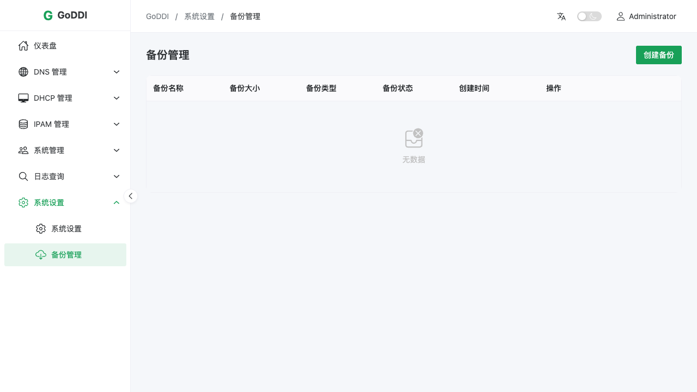

# GoDDI

[English](README.md) | 简体中文

GoDDI 是一套紧凑、自托管的 DDI 管理平台，在同一个 Web 控制台中整合权威/递归 DNS、DHCP 与 IP 地址管理。Linux 发行版为单个可执行文件，已内嵌 Web 前端和数据库迁移。

## 主要能力

- DNS 区域与记录、递归转发、缓存、查询日志、安全过滤和诊断客户端
- DHCP 地址池、保留地址、选项、租约和活动日志
- IPAM 地址空间、子网、IP 地址、分配状态和导入导出
- 用户、角色、用户组、权限、API 令牌、TOTP、会话和审计日志
- 全量数据备份恢复、系统设置、健康检查和 Prometheus 指标
- 支持英文、简体中文及响应式布局的 Vue 3 控制台
- SQLite WAL 模式，适合低运维成本的单节点部署

## 演示







## v0.1.3 功能边界

GoDDI v0.1.3 面向稳定的单节点部署，仅支持 SQLite。DNS-over-TLS/HTTPS/QUIC 配置、DHCP 高可用、SSO、集群和应用扩展运行时为预留 API，本版本会返回 `501 Not Implemented`。

## 快速开始

### Linux 单文件部署

下载发行版二进制：

```bash
curl -fL -o goddi \
  https://github.com/jincaiw/GoDDI/releases/download/v0.1.3/goddi-v0.1.3-linux-amd64
chmod +x goddi
sudo install -m 0755 goddi /usr/local/bin/goddi
```

GoDDI 使用 DNS、DHCP 特权端口。快速体验可使用 root 运行；生产环境建议仅授予必要的 Linux capabilities：

```bash
sudo setcap 'cap_net_bind_service,cap_net_raw=+ep' /usr/local/bin/goddi
export GODDI_SECURITY_JWT_SECRET="$(openssl rand -hex 32)"
export GODDI_SECURITY_ENCRYPTION_KEY="$(openssl rand -hex 32)"
export GODDI_ADMIN_USERNAME=admin
read -rsp '初始管理员密码（至少12位，包含大小写字母和数字）: ' GODDI_ADMIN_PASSWORD; echo
export GODDI_ADMIN_PASSWORD
goddi serve
```

访问 `http://服务器IP:6080`，使用初始管理员登录。管理员环境变量只会在数据库中没有用户时使用；首次成功启动后应删除。未提供配置文件时，运行数据默认保存在当前目录的 `./data`。

只体验 Web 控制台、不启动 DNS 和 DHCP：

```bash
export GODDI_SECURITY_JWT_SECRET="$(openssl rand -hex 32)"
export GODDI_SECURITY_ENCRYPTION_KEY="$(openssl rand -hex 32)"
export GODDI_ADMIN_USERNAME=admin
read -rsp '初始管理员密码: ' GODDI_ADMIN_PASSWORD; echo
export GODDI_ADMIN_PASSWORD
export GODDI_DNS_ENABLED=false
export GODDI_DHCP_ENABLED=false
goddi serve
```

### systemd 服务部署

创建服务用户和目录：

```bash
sudo useradd --system --home /var/lib/goddi --shell /usr/sbin/nologin goddi
sudo install -d -o goddi -g goddi -m 0750 /var/lib/goddi /var/log/goddi
sudo install -d -o root -g goddi -m 0750 /etc/goddi
sudo install -m 0755 goddi /usr/local/bin/goddi
sudo install -m 0644 deployments/systemd/goddi.service /etc/systemd/system/goddi.service
```

将密钥放在 unit 文件之外：

```bash
sudo tee /etc/goddi/goddi.env >/dev/null <<EOF
GODDI_SECURITY_JWT_SECRET=$(openssl rand -hex 32)
GODDI_SECURITY_ENCRYPTION_KEY=$(openssl rand -hex 32)
GODDI_ADMIN_USERNAME=admin
GODDI_ADMIN_PASSWORD=CHANGE-ME-Before-Starting-123!
EOF
sudo chown root:goddi /etc/goddi/goddi.env
sudo chmod 0640 /etc/goddi/goddi.env
sudoedit /etc/goddi/goddi.env # 启动前替换示例管理员密码。
```

可选：安装并修改完整配置：

```bash
sudo install -m 0640 -o root -g goddi config.yaml /etc/goddi/config.yaml
```

启用服务：

```bash
sudo systemctl daemon-reload
sudo systemctl enable --now goddi
sudo systemctl status goddi
sudo journalctl -u goddi -f
```

仓库提供的 unit 使用非特权 `goddi` 用户，仅授予 `CAP_NET_BIND_SERVICE` 与 `CAP_NET_RAW`，并启用了 systemd 文件系统加固。
首个管理员创建成功后，请从 `/etc/goddi/goddi.env` 删除 `GODDI_ADMIN_USERNAME` 和 `GODDI_ADMIN_PASSWORD`，然后重启服务。

## 配置说明

默认 HTTP 端口为 `6080`，DNS 监听 TCP/UDP `53`。程序会在文件存在时加载 `/etc/goddi/config.yaml`，并支持通过 `GODDI_*` 环境变量覆盖。生产环境必须替换 `GODDI_SECURITY_JWT_SECRET`，并建议设置 `GODDI_SECURITY_ENCRYPTION_KEY` 作为独立的 TOTP 密钥加密材料。

常用端点：

- Web 控制台：`http://服务器IP:6080`
- 健康检查：`GET /health`
- 监控指标：`GET /metrics`
- API：`/api/v1`

完整配置模板参见 [config.yaml](config.yaml)。

## Docker

DHCP 依赖广播流量，因此附带的 Compose 文件在 Linux 上使用 host 网络：

```bash
export GODDI_SECURITY_JWT_SECRET="$(openssl rand -hex 32)"
export GODDI_SECURITY_ENCRYPTION_KEY="$(openssl rand -hex 32)"
read -rsp '初始管理员密码: ' GODDI_ADMIN_PASSWORD; echo
export GODDI_ADMIN_PASSWORD
docker compose up -d --build
```

Docker Engine 的 host 网络主要适用于 Linux。其他平台建议禁用 DHCP，并显式映射 HTTP 与 DNS 端口。

## 构建与测试

要求 Go 1.26+、Node.js 22+ 和 pnpm 10+。

```bash
cd web-admin
pnpm install --frozen-lockfile
pnpm build
cd ..
go test -race -cover ./...
go vet ./...
go build ./cmd/goddi
```

由于 `web/dist` 会在编译时嵌入 Go 二进制，因此必须先构建前端（`web-admin` 构建产物需复制到 `web/dist`，`make web-build` 会自动完成）。端到端测试位于 `e2e/` 目录（Playwright），需先启动测试服务器并以 `GODDI_TEST_BASE_URL` 指向它。

## 首次部署检查清单

生产上线前逐项确认：

1. **密钥**：已通过环境变量设置独立的 `GODDI_SECURITY_JWT_SECRET` 与 `GODDI_SECURITY_ENCRYPTION_KEY`（各 32 字节以上随机值），并已离线备份。
2. **管理员**：初始管理员使用强密码（默认密码策略要求大小写字母、数字、符号），并为管理员账号启用 TOTP 双因素。
3. **TLS**：已启用内置 TLS（`server.tls.enabled: true`）或将服务置于 HTTPS 反向代理之后；浏览器登录与 API 令牌不应走明文 HTTP。
4. **网络边界**：管理端口（默认 6080）未暴露到公网；`/metrics`、`/api/v1/openapi.json`（如不需要，可设 `server.expose_openapi: false`）的访问范围已按需收敛。
5. **DNS 面硬化**：面向互联网的部署建议设置 `dns.allow_private_upstream: false` 关闭对内网地址的转发；递归白名单 `dns.recursion.allow_nets` 已按实际网段收紧。
6. **监听端口**：DNS/DHCP 监听地址正确（53/67 需 root 或 `CAP_NET_BIND_SERVICE`），必要时用 `GODDI_DNS_LISTENERS_UDP_ADDR`/`GODDI_DNS_LISTENERS_TCP_ADDR` 覆盖。
7. **日志与保留**：`log.query_log_enabled` 与 `log.retention_days` 按合规要求配置。
8. **备份**：确认定时备份任务在运行，并**实际执行一次恢复演练**。
9. **监控**：已抓取 `/metrics`，并在目标环境实际加载告警规则；仓库中的 [docs/prometheus-alerts.yml](docs/prometheus-alerts.yml) 只是示例，未作为真实 Prometheus 告警链路证据。
10. **升级路径**：使用 systemd（`deployments/goddi.service`）或 Docker 管理进程，重启后数据目录与密钥保持不变。

## 安全建议

- 控制台的“完整备份”包含 DNS、DHCP、IPAM、DNS 安全策略及数据库设置，不包含用户、令牌、审计日志、外部配置和加密密钥。灾难恢复备份应停服后备份整个数据目录、配置和密钥；运行中的 SQLite 数据库应采用支持 SQLite 的一致性备份方式，不要单独复制主数据库文件。

- 两个安全密钥应安全持久保存并单独备份，重启和升级时不要重新生成。更改加密密钥会导致已有 TOTP 密文无法解密。
- 基线测试范围和仍需现场验证的部署场景见 [v0.1.1 生产评审](docs/production-review-v0.1.1.md)。

- 内置 HTTP 服务支持原生 TLS（`server.tls`，默认关闭）。生产环境可在反向代理终止 TLS，或直接启用内置 TLS（HSTS 等安全响应头仅在服务端 TLS 开启时发送）。
- 通过防火墙或反向代理限制 `/metrics` 与管理控制台访问范围。
- 定期备份 `/var/lib/goddi`，并实际验证恢复流程。
- 为 API 令牌设置有效期和 IP 限制，按最小权限分配角色，并为管理员启用 TOTP。

## 许可证

[MIT](LICENSE)
